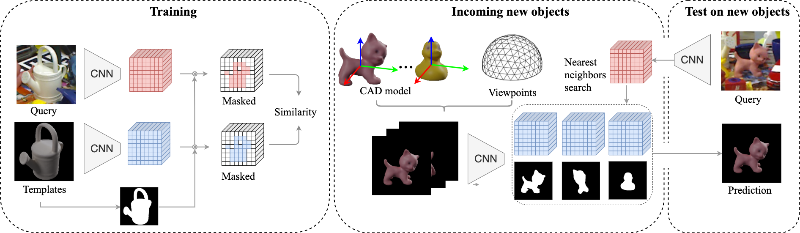

# template-pose
Pytorch implementation of [**"Templates for 3D Object Pose Estimation Revisited: Generalization to New objects and Robustness to Occlusions"**](https://arxiv.org/abs/2203.17234) paper (accepted to CVPR 2022)

**[Van Nguyen Nguyen](https://nv-nguyen.github.io/), 
[Yinlin Hu](https://yinlinhu.github.io/), 
[Yang Xiao](https://youngxiao13.github.io/), 
[Mathieu Salzmann](https://people.epfl.ch/mathieu.salzmann) and 
[Vincent Lepetit](https://vincentlepetit.github.io/)**

Check out our [**paper**](https://arxiv.org/abs/2203.17234) and [**webpage**](https://nv-nguyen.github.io/template-pose/) for details!



If our project is helpful for your research, please consider citing : 
``` Bash
@inproceedings{nguyen2022template,
    title={Templates for 3D Object Pose Estimation Revisited: Generalization to New objects and Robustness to Occlusions},
    author={Nguyen, Van Nguyen and Hu, Yinlin and Xiao, Yang and Salzmann, Mathieu and Lepetit, Vincent},
    booktitle={Proceedings IEEE Conf. on Computer Vision and Pattern Recognition (CVPR)},
    year={2022}}
```
## Table of Content
* [Methodology](#Methodology)
* [Installation](#Installation)
* [Datasets](#Datasets)
* [T-LESS](#T-LESS)
* [LINEMOD and Occlusion-LINEMOD](#LINEMOD)
* [Acknowledgement](#Acknowledgement)
## Methodology :student:

We introduce *template-pose*, which estimates 3D pose of new objects (can be very different
from the training ones, i.e LINEMOD dataset) with only their 3D models. Our method requires neither a training phase
on these objects nor images depicting them.


Two settings are considered in this work:

|       Dataset       |    Predict ID object    | In-plane rotation | 
|:-------------------:|:-----------------------:|:-----------------:|
| (Occlusion-)LINEMOD |           Yes           |        No         |
|       T-LESS        |           No            |        Yes        |

## Installation :man_mechanic:

We recommend creating a new Anaconda environment to use *template-pose*. Use the following commands to setup a new environment:
```
conda env create -f environment.yml
conda activate template
```
**Optional:** Installation of [BlenderProc](https://github.com/DLR-RM/BlenderProc) is required to render synthetic images. It can be ignored if you use our provided template. More details can be found in [Datasets](#Datasets).
## Datasets :smiley_cat: :electric_plug:
Before downloading the datasets, you may change [this line](https://github.com/nv-nguyen/template-pose/blob/main/config.json#L2) to define the $ROOT folder (to store data and results). 

There are two options:
1. To download our pre-processed datasets (15GB) + SUN397 dataset (37GB)
```
./data/download_preprocessed_data.sh
```
**Optional:** You can download with following gdrive links and unzip them manually. We recommend keeping $DATA folder structure as detailed in [./data/README](https://github.com/nv-nguyen/template-pose/blob/main/data/README.md) to keep pipeline simple:
- [LINEMOD and Occlusion-LINEMOD (3GB)](https://drive.google.com/file/d/1XkQBt01nlfCbFuBsPMfSHlcNIzShn7e7/view?usp=sharing) -> then run ```python -m data.crop_image_linemod```
- [T-LESS (11GB)](https://drive.google.com/file/d/1d2GoswrnvcTlwFi_LWoCiy1uS5OkCiF1/view?usp=sharing)
- [Templates (both T-LESS and LINEMOD) (1.7GB)](https://drive.google.com/file/d/17_2SlfVtu9qYo82zPtqjL_GF99OWJvF5/view?usp=sharing)
- [Dataframes including query-template pairwise used for training (11MB)](https://drive.google.com/file/d/10XVLb-DFIayBu7RZCnsm7NuG0vPZOaTc/view?usp=sharing)
- [SUN397, randomized background for training on T-LESS (37GB)](vision.princeton.edu/projects/2010/SUN/SUN397.tar.gz)

2. To download the original datasets and process them from scratch (process GT poses, render templates, compute nearest neighbors). All the main steps are detailed in [./data/README](https://github.com/nv-nguyen/template-pose/blob/main/data/README.md).
```
./data/download_and_process_from_scratch.sh
```
For any training with backbone ResNet50, we initialise with pretrained features of MOCOv2 which can be downloaded with the following command:
```
python -m lib.download_weight --model_name MoCov2
```
## T-LESS :electric_plug:
#### 1. To launch a training on T-LESS:
```
python train_tless.py --config_path ./config_run/TLESS.json
```
#### 2. To reproduce the results on T-LESS:
To download pretrained weights (by default, they are saved at $ROOT/pretrained/TLESS.pth):
```
python -m lib.download_weight --model_name TLESS
```
**Optional:** You can download manually with [this link](https://drive.google.com/drive/folders/11SQYPrG3pX31Qszf8R13s7Aaa5MO57lb?usp=sharing)

To evaluate model with the pretrained weight:
```
python test_tless.py --config_path ./config_run/TLESS.json --checkpoint $ROOT/pretrained/TLESS.pth
```

## LINEMOD and Occlusion-LINEMOD :smiley_cat:
#### 1. To launch a training on LINEMOD:
```
python train_linemod.py --config_path config_run/LM_$backbone_$split_name.json
```
For example, with “base" backbone and split #1:
```
python train_linemod.py --config_path config_run/LM_baseNetwork_split1.json
```

#### 2. To reproduce the results on LINEMOD:
To download pretrained weights (by default, they are saved at $ROOT/pretrained):
```
python -m lib.download_weight --model_name LM_$backbone_$split_name
```
**Optional:** You can download manually with [this link](https://drive.google.com/drive/folders/11SQYPrG3pX31Qszf8R13s7Aaa5MO57lb?usp=sharing)

To evaluate model with a checkpoint_path:
```
python test_linemod.py --config_path config_run/LM_$backbone_$split_name.json --checkpoint checkpoint_path
```
For example, with “base" backbone and split #1:
```
python -m lib.download_weight --model_name LM_baseNetwork_split1
python test_linemod.py --config_path config_run/LM_baseNetwork_split1.json --checkpoint $ROOT/pretrained/LM_baseNetwork_split1.pth
```
## Acknowledgement

The code is adapted from [PoseContrast](https://github.com/YoungXIAO13/PoseContrast), [DTI-Clustering](https://github.com/monniert/dti-clustering), [CosyPose](https://github.com/ylabbe/cosypose) and [BOP Toolkit](https://github.com/thodan/bop_toolkit). Many thanks to them!

The authors thank Martin Sundermeyer, Paul Wohlhart and Shreyas Hampali for their fast reply, feedback!

## Contact
If you have any question, feel free to create an issue or contact the first author at van-nguyen.nguyen@enpc.fr